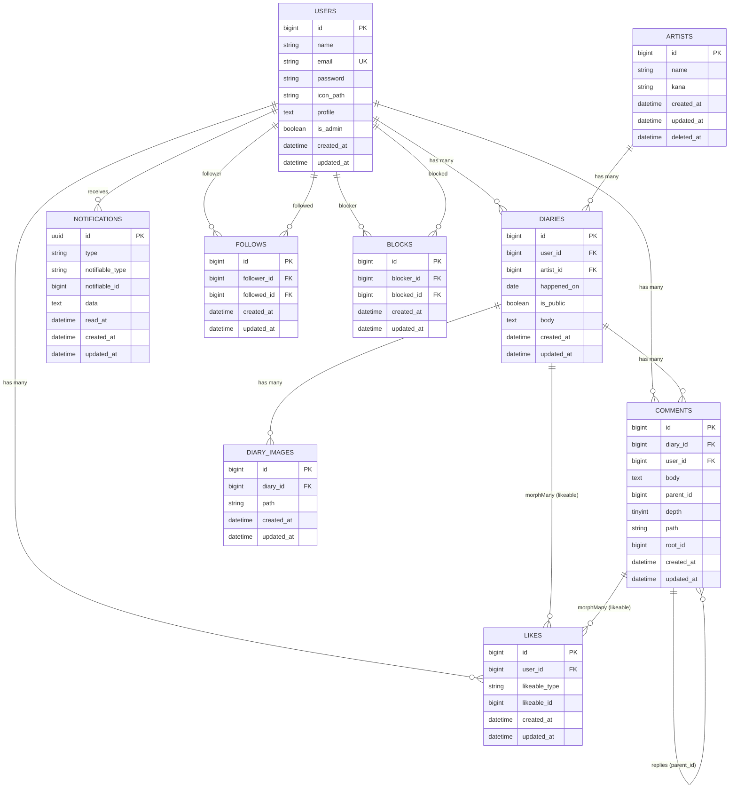

# Oshi-Graphy（推しグラフィー）バックエンド

[](https://php.net/)
[](https://laravel.com)
[](https://laravel.com/docs/sanctum)
[](https://www.mysql.com/)
[](https://pestphp.com/)

**【アプリ公開URL（フロントエンド）】:** [https://oshi-graphy.com](https://oshi-graphy.com)
**【API Base URL（本リポジトリ）】:** `https://ichitaka58.sakura.ne.jp/oshi-graphy/`（配下の `/api/*` を参照）

## 🔌 本リポジトリの役割

本リポジトリは、Next.js製フロントエンド **[oshi-graphy-frontend](https://github.com/ichitaka58/oshi-graphy-frontend)** に対して REST API（`routes/api.php`、Laravel Sanctum によるトークン認証）を提供するバックエンドです。ユーザーが実際に触れる画面は oshi-graphy-frontend 側にあり、本リポジトリはデータの永続化・認証・ビジネスロジックを担当します。

> **補足:** 本プロジェクトはもともと Blade + Alpine.js によるフルスタックのWebアプリとして開発したものです。フロントエンドを Next.js で作り直すにあたり、本リポジトリに Sanctum トークン認証ベースの REST API（`routes/api.php` 配下）を追加し、以降はそちらがフロントエンドから利用される現行の窓口になっています。移行時の経緯として、旧来の Blade ビュー（`routes/web.php`、セッション認証）もコード上は残っています。

## 📖 アプリの概要
Oshi-Graphy（推しグラフィー）は、80〜90年代から今も活躍するアーティストの推し活を楽しむ**中高年世代を対象**にした推し活ダイアリー共有アプリです。

ライブ参戦や日常の推し活を日記として残し、同じ世代の仲間と共有・交流できる、落ち着いたクローズドな場を提供します。

### 💡 制作の背景・目的
推し活の思い出を一つにまとめて残せる場として、また既存の推し活アプリは若年層向けが多く、同世代の同じアーティストのファンと落ち着いて交流できる場として、このアプリを開発しました。

## ✨ 提供している機能（API）
- **ダイアリー機能**
  - 公開／非公開設定
  - 画像添付
  - 推しアーティストの紐付け機能
- **交流機能**
  - コメント & いいね（ダイアリー／コメントに対するスレッド形式）
  - フォロー機能（ユーザー間の相互フォロー／フォロワー一覧）
- **マイページ・ユーザー管理**
  - ユーザープロフィール（アイコン画像・自己紹介）
  - ブロック機能（ユーザー間の相互ブロック／ブロックユーザー一覧）
- **通知機能**
  - 既読管理、未読数取得、通知一覧
  - 管理者向け：アーティスト情報管理（CRUD）
- **AIアシスト機能**
  - Gemini API連携による日記下書き補助

## 📡 主なAPIエンドポイント

ベースパスは `/api`。ログイン・登録以外はすべて `auth:sanctum` ミドルウェアで保護されている。

| グループ | 主なエンドポイント | 備考 |
| --- | --- | --- |
| 認証 | `POST /register`, `POST /login`, `POST /logout`, `GET /user` | ログイン成功時に `access_token` を返却（フロント側で httpOnly Cookie 化） |
| 日記 | `GET/POST/PUT/DELETE /diaries`, `GET /public-diaries` | `apiResource` |
| コメント・いいね | `POST /diaries/{diary}/comments`, `POST /diaries/{diary}/like`, `POST /comments/{comment}/like` | コメント投稿は `throttle:20,1` |
| フォロー・ブロック | `POST /users/{user}/follow`, `POST /users/{user}/block` | 相互フォロー／相互ブロック |
| 通知 | `GET /notifications`, `GET /notifications/unread-count`, `POST /notifications/mark-all-read` | |
| アカウント | `PATCH /profile`, `PUT /password`, `PUT /user_profile` | |
| AIアシスト | `POST /ai/diary-suggest` | Gemini API 連携 |
| 管理者 | `/admin/artists`（`apiResource`） | `can:access-admin` を追加要求 |

## 🛠 技術スタック

### Backend / DB
- PHP 8.4
- Laravel 12
- MySQL 8

### Auth / API
- Laravel Sanctum（トークン認証、フロントエンドAPI用）
- Laravel Breeze（JP ローカライズ、旧Blade UIのセッション認証・レガシー）
- Gemini API (Google Generative AI)

### Infrastructure / Environment
- **ローカル開発環境**: Docker / Laravel Sail
- **本番環境**: さくらレンタルサーバ (PHP 8.3)
- **画像ストレージ**: Cloudflare R2（S3互換、`league/flysystem-aws-s3-v3`）／開発環境はローカルディスク
- **CI/CD**: GitHub Actions

## 🚀 デプロイの仕組み
GitHub Actionsにより、`main`ブランチへのpushをトリガーにして、さくらレンタルサーバへSSH接続し、**自動デプロイ**を実施しています。
デプロイ時はLaravelのメンテナンスモードを使用し、依存関係の更新（composer）、マイグレーション、キャッシュクリアを自動化しています。

フロントエンド（Next.js / Vercel）は別リポジトリ・別デプロイパイプラインで管理されており、本リポジトリのデプロイ対象はAPIサーバーのみです。

## 🖥 開発環境の構築（ローカル）

Laravel Sail環境を利用してローカル環境を構築する手順です。

```bash
# 1. リポジトリのクローン
git clone https://github.com/ichitaka58/oshi-graphy.git
cd oshi-graphy

# 2. 環境変数の設定
cp .env.example .env

# 3. コンテナのビルドと起動
./vendor/bin/sail up -d

# 4. パッケージのインストール
./vendor/bin/sail composer install
./vendor/bin/sail npm install

# 5. アプリケーションキーの生成
./vendor/bin/sail artisan key:generate

# 6. マイグレーションとシードの実行（必要に応じて）
./vendor/bin/sail artisan migrate --seed

# 7. フロントエンドのビルド
./vendor/bin/sail npm run dev
```

設定完了後、`http://localhost` にアクセスして動作を確認できます（旧Blade UI）。実際の画面で動作確認したい場合は、`oshi-graphy-frontend` 側を本リポジトリの `http://localhost` を向くよう設定して起動してください。

## 🖼 画像ストレージ

日記画像・ユーザーアイコンの保存先は `config/filesystems.php` の `media_disk`（`MEDIA_DISK` 環境変数）で切り替わる。アプリケーションコードは `Storage::disk(config('filesystems.media_disk'))` 経由でアクセスするため、ディスクの実体を意識せず同じコードで両環境に対応する。

| 環境 | `MEDIA_DISK` | 実体 |
| --- | --- | --- |
| ローカル開発 | `public`（未設定時のデフォルト） | `storage/app/public`（`php artisan storage:link` 後 `/storage/*` で配信） |
| 本番 | `r2` | Cloudflare R2 バケット（`R2_ACCESS_KEY_ID` / `R2_SECRET_ACCESS_KEY` / `R2_BUCKET` / `R2_ENDPOINT` / `R2_URL` を `.env` に設定） |

既存画像をローカル `public` ディスクから R2 へ移す場合は、`php artisan media:migrate-to-r2`（`--dry` でプレビュー可）を使用する。DBとの整合性は見ずディレクトリ配下を機械的にコピーする実装のため、実行前に対象ディスクの状態を確認すること。

## 🧪 テスト

Pestを使用して、主要な機能に対する自動テスト（フィーチャーテスト・ユニットテスト）を実装しています。
ローカル環境構築後、以下のコマンドでテストを実行し、動作確認が行えます。

```bash
./vendor/bin/sail php artisan test
```

## 📊 ER Diagram
主要エンティティのリレーション構造です。

<details>
<summary>ER図を表示する</summary>


</details>
