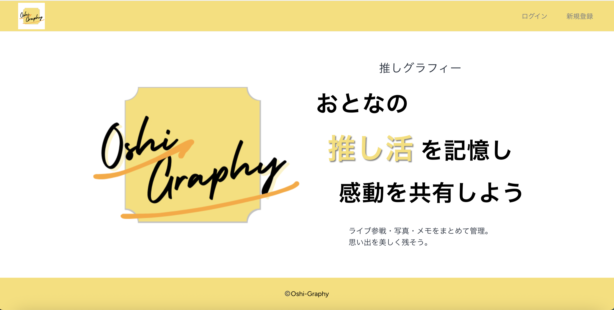
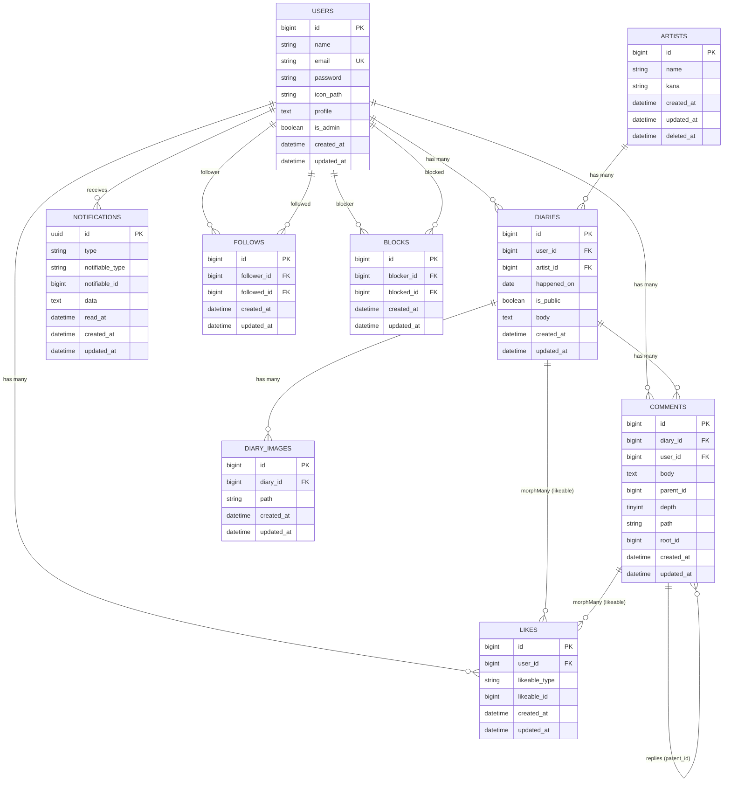

# Oshi-Graphy（推しグラフィー）



[](https://php.net/)
[](https://laravel.com)
[](https://www.mysql.com/)
[](https://tailwindcss.com/)
[](https://alpinejs.dev/)
[](https://pestphp.com/)

**【アプリ公開URL】:** [https://ichitaka58.sakura.ne.jp/oshi-graphy/](https://ichitaka58.sakura.ne.jp/oshi-graphy/)

## 📖 アプリの概要
Oshi-Graphy（推しグラフィー）は、80〜90年代から今も活躍するアーティストの推し活を楽しむ**中高年世代を対象**にした推し活ダイアリー共有アプリです。

ライブ参戦や日常の推し活を日記として残し、同じ世代の仲間と共有・交流できる、落ち着いたクローズドな場を提供します。

### 💡 制作の背景・目的
推し活の思い出を一つにまとめて残せる場として、また既存の推し活アプリは若年層向けが多く、同世代の同じアーティストのファンと落ち着いて交流できる場として、このアプリを開発しました。

## ✨ 主な機能
- **ダイアリー機能**
  - 公開／非公開設定
  - 画像添付
  - 推しアーティストの紐付け機能
- **交流機能**
  - コメント & いいね（ダイアリー／コメントに対するスレッド形式）
  - フォロー機能（ユーザー間の相互フォロー／フォロワー一覧）
- **マイページ・ユーザー管理**
  - ユーザープロフィール（アイコン画像・自己紹介）
  - ブロック機能（ユーザー間の相互ブロック／ブロックユーザー一覧）
- **通知・ダッシュボード機能**
  - 既読管理、ベルアイコンでの未読数表示、通知リスト／詳細リンク
  - ダッシュボード（通知一覧、クイックリンク）
  - 管理者向け：アーティスト情報管理（CRUD）
- **AIアシスト機能 / 検索補助**
  - Gemini API連携による日記下書き補助（AIアシスト）
  - Select2 などを用いた検索UI補助
- **UI / UX**
  - レスポンシブデザイン
  - ダークモード対応

## 🛠 技術スタック

### Backend / DB
- PHP 8.4
- Laravel 12
- MySQL 8

### Frontend
- Tailwind CSS / Alpine.js / Vite / Blade Components

### Auth / API
- Laravel Breeze（JP ローカライズ）
- Gemini API (Google Generative AI)

### Infrastructure / Environment
- **ローカル開発環境**: Docker / Laravel Sail
- **本番環境**: さくらレンタルサーバ (PHP 8.3)
- **CI/CD**: GitHub Actions

## 🚀 デプロイの仕組み
GitHub Actionsにより、`main`ブランチへのpushをトリガーにして、さくらレンタルサーバへSSH接続し、**自動デプロイ**を実施しています。
デプロイ時はLaravelのメンテナンスモードを使用し、依存関係の更新（composer）、マイグレーション、キャッシュクリアを自動化しています。

## 🖥 開発環境の構築（ローカル）

Laravel Sail環境を利用してローカル環境を構築する手順です。

```bash
# 1. リポジトリのクローン
git clone https://github.com/ichitaka58/oshi-graphy.git
cd oshi-graphy

# 2. 環境変数の設定
cp .env.example .env

# 3. コンテナのビルドと起動
./vendor/bin/sail up -d

# 4. パッケージのインストール
./vendor/bin/sail composer install
./vendor/bin/sail npm install

# 5. アプリケーションキーの生成
./vendor/bin/sail artisan key:generate

# 6. マイグレーションとシードの実行（必要に応じて）
./vendor/bin/sail artisan migrate --seed

# 7. フロントエンドのビルド
./vendor/bin/sail npm run dev
```

設定完了後、`http://localhost` にアクセスして動作を確認できます。

## 🧪 テスト

Pestを使用して、主要な機能に対する自動テスト（フィーチャーテスト・ユニットテスト）を実装しています。
ローカル環境構築後、以下のコマンドでテストを実行し、動作確認が行えます。

```bash
./vendor/bin/sail php artisan test
```

## 📊 ER Diagram
主要エンティティのリレーション構造です。

<details>
<summary>ER図を表示する</summary>


</details>
